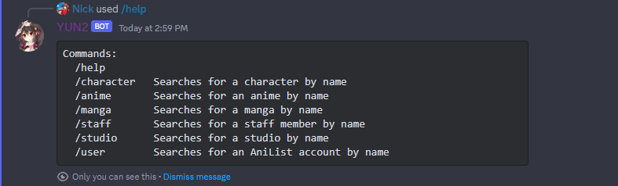

<h3 align="center">AniList Discord Bot</h3>
<p align="center">A simple Discord bot for searching AniList.co</p>

## Usage



### Custom Build

1. Follow the requirements in the [building section](#building) and run `cargo build --release`
2. Go to the [Discord Developer Portal](https://discordapp.com/developers/applications/) and create an application
3. Go to the "Bot" page and and click "Add a bot"
4. Set the `DISCORD_TOKEN` environment variable (`.env` or command line) to the token generated for your bot
5. Run the built binary

Example:

```bash
./target/release/discord-search-bot DISCORD_TOKEN="foobar" 
```

### Docker Container 

A Docker container is provided through the [Github Container Registry](https://docs.github.com/en/packages/working-with-a-github-packages-registry/working-with-the-container-registry).

1. Pull the image with `docker pull ghcr.io/anilist/discord-search-bot`
2. Go to the [Discord Developer Portal](https://discordapp.com/developers/applications/) and create an application
3. Go to the "Bot" page and and click "Add a bot"
4. Set the `DISCORD_TOKEN` environment variable (`.env` or command line) to the token generated for your bot
5. Run the image

Example:

```bash
export DISCORD_TOKEN=foobar
docker run -e DISCORD_TOKEN ghcr.io/anilist/discord-search-bot
```

## Contributing

### Requirements

- [Rust](https://www.rust-lang.org/) toolchain
- A Discord developer account for a token to test with.

### Building

Simply run `cargo build` or `cargo build --release`

## License

MIT © [Josh Star](./LICENSE)
